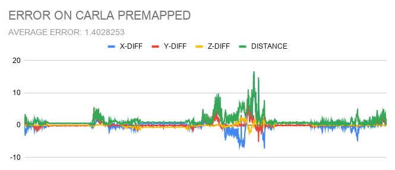

# Generating Ground Truth Readings

This branch is for generating the ground truth map that can be used to quantify the results of the localisation. 

We use Carla ( Gazebo can also be used ) to generate the lidar data which is sent to the code which generates the map, by merging each frame recieved according to the localisation values from the Carla bag file. The map is saved in the ``` /tmp/dump ``` directory just like the original code. This ground truth coordinates are published as a rostopic. These can be used to generate error values using [the following repo](https://github.com/ShrinivasSK/SLAM_Error_Calculator). 

## Results from our Datasets

<p align='center'>
    
</p>

## Run the package

You may process a rosbag using the following command:

```
roslaunch lego_loam_bor run.launch rosbag:=/path/to/your/rosbag lidar_topic:=/velodyne_points
```

Change the parameters `rosbag`, `lidar_topic` as needed.


Some sample bags can be downloaded from [here](https://github.com/RobustFieldAutonomyLab/jackal_dataset_20170608).
